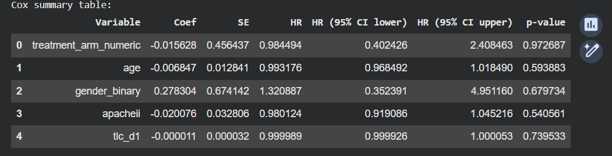
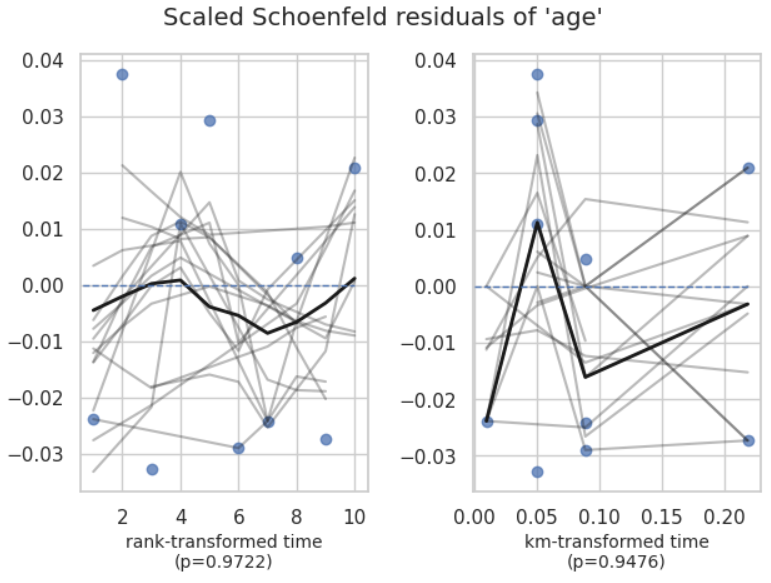
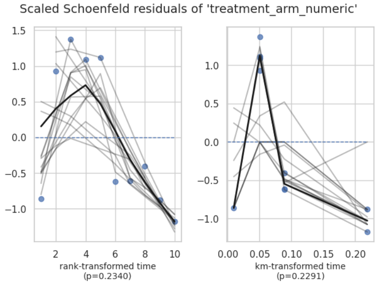
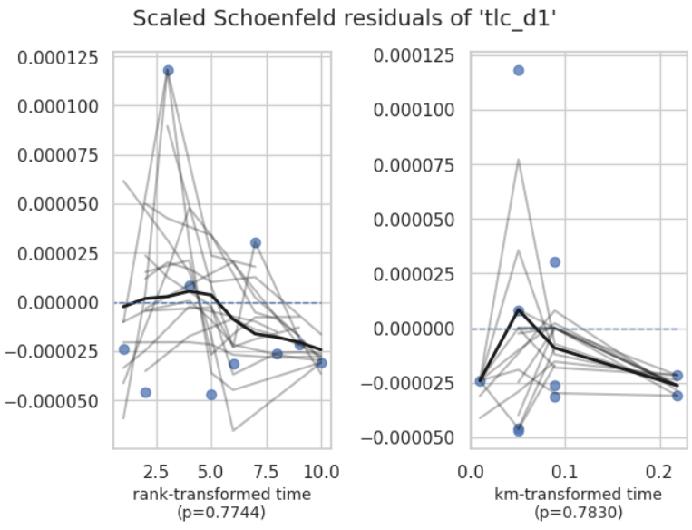
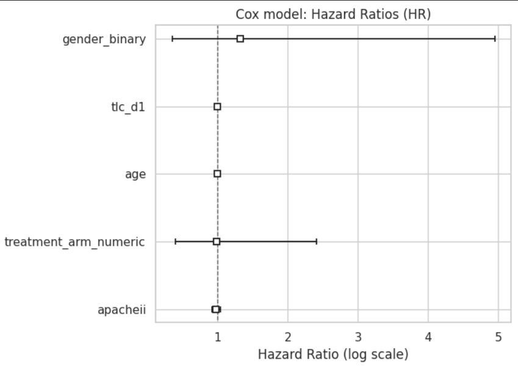
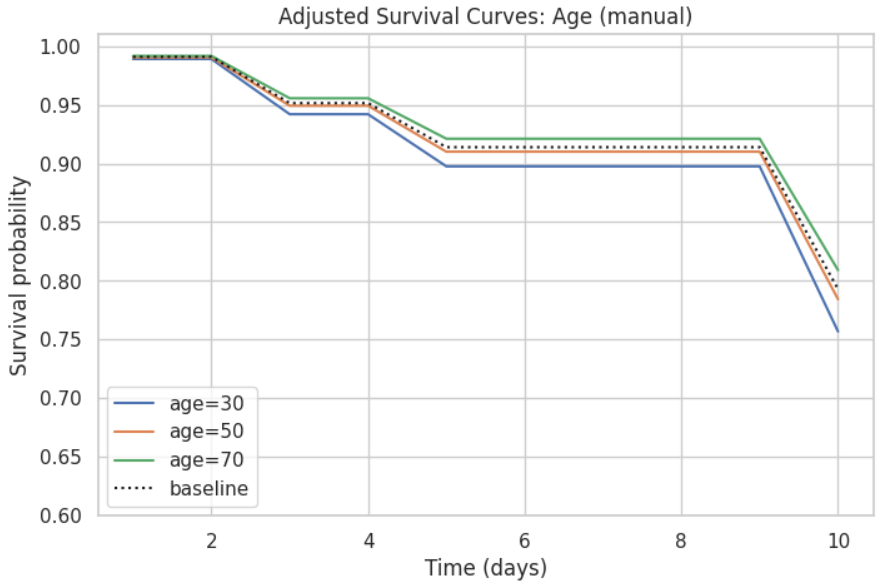
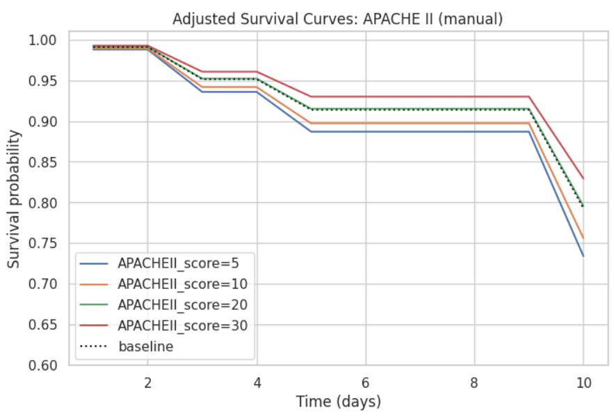
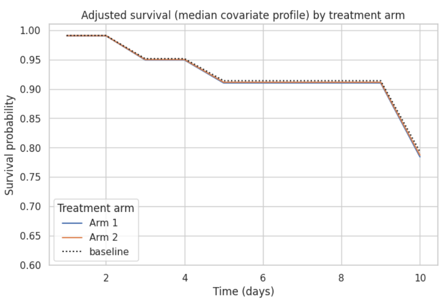

# 🧪📈 Survival Analysis of Chlorhexidine Trial Outcomes Using Python  

<p align="center">

  <!-- FULL BADGE COLLECTION -->
  
  
  
  
  
  
  
  
  


</p>

<hr>

This project is based on a real clinical trial case study titled:  
**“Effectiveness of Oral Hygiene with Chlorhexidine Mouthwash with 0.12% and 0.2% Concentration on Incidence of VAP”**  
Published in *Annals of International Medical and Dental Research (2021)*.  

The complete article is included in the repository at:  
📄 `/document/Publication.pdf`  

This repository reproduces and interprets **time-to-VAP (Ventilator-Associated Pneumonia)** outcomes using classical Survival Analysis methods in Python.  
All results, tables, and plots are generated using the Python analysis script and Jupyter workflow.

---

# 1️⃣ Project Title  
**Survival Analysis of Chlorhexidine Trial Outcomes Using Python**

---

# 2️⃣ Project Summary ✍️  
This project analyzes patient-level data from a randomized controlled trial comparing **0.12% vs 0.20% chlorhexidine mouthwash** for preventing Ventilator-Associated Pneumonia (VAP) in intubated ICU patients.

**Outcome:**  
- Time (days) until VAP (event = 1)  
- Censoring for discharge, LAMA, or death (event = 0)

**Why survival analysis?**  
Because follow-up duration is variable, and many patients are censored — requiring **Kaplan–Meier**, **Log-Rank**, and **Cox Proportional Hazards** models.

**Learning outcomes:**  
Kaplan–Meier estimation, Log-Rank test, Cox modelling, Schoenfeld tests, adjusted survival curves, hazard interpretation.

---

# 3️⃣ Dataset Description 📚  

**Source:** Hospital-based randomized controlled trial (n = 140).  
**Working data:** Cleaned dataset based on `/data/Chlorhexidine Trials Data Cleaned.xlsx`.

### 📘 **Core Variables**

| Column           | Description                            | Type        |
|------------------|----------------------------------------|-------------|
| Age              | Age in years                           | Continuous  |
| Gender           | Male / Female                          | Categorical |
| TrialArm_num     | 1 = 0.12%, 2 = 0.20%                   | Categorical |
| APACHEII         | Severity score                         | Continuous  |
| TLC_D1           | Day-1 leukocyte count                  | Continuous  |
| time             | Time to VAP / censoring                | Continuous  |
| event            | 1 = VAP, 0 = No VAP                    | Binary      |

---

# 4️⃣ Problem Statement ❓  
This project answers key clinical questions:

- Does **chlorhexidine 0.20%** reduce the hazard of VAP compared to 0.12%?
- Is VAP-free survival different between treatment groups?
- Do baseline predictors (Age, APACHE II, TLC D1, Gender) influence time to VAP?
- Do survival curves differ significantly via Log-Rank test?
- What do hazard ratios from the Cox model imply clinically?

---

# 5️⃣ Objectives 🎯  

- Clean and preprocess clinical trial dataset  
- Perform EDA and baseline descriptive statistics  
- Estimate survival curves (overall and by treatment arm)  
- Compare groups with Log-Rank test  
- Fit Cox PH model and extract hazard ratios  
- Check PH assumption with Schoenfeld residuals  
- Generate adjusted survival curves  
- Interpret survival and hazard outputs clinically  

---

# 6️⃣ Methodology 🛠️  

## 6.1 Data Preparation  
- Renamed columns (APACHE II → APACHEII, TLC Day 1 → TLC_D1)  
- Encoded categorical variables (gender, trial arm)  
- Ensured numeric time/event columns  
- Imputed missing APACHEII and TLC_D1 using median values  

## 6.2 Exploratory Data Analysis 🔍  
- Summary statistics  
- Histograms for Age, APACHEII, TLC  
- Event distribution by arm  
- Life tables  
- Initial KM survival visualization  

## 6.3 Survival Modelling  
- Kaplan–Meier overall  
- KM by treatment arm  
- Log-Rank test  
- Cox Proportional Hazards model  
- PH assumption checks  
- Adjusted survival curves for Age, APACHEII, Treatment Arm  

---

# 7️⃣ Python Implementation Structure 💻  

```
.
├── data/
│ ├── Chlorhexidine Trials Data Cleaned.xlsx
│ ├── Data form Chlorhexidine Trial (Raw).xlsx
│
├── document/
│ ├── Publication.pdf
│
├── results/
│ ├── km_overall.png
│ ├── km_by_arm.png
│ ├── km_summary.png
│ ├── cox_summary.png
│ ├── cox_forest.png
│ ├── ph_age.png
│ ├── ph_gender.png
│ ├── ph_apache.png
│ ├── ph_treatment.png
│ ├── ph_tlcd1.png
│ ├── adj_curve_age.png
│ ├── adj_curve_apache.png
│ ├── adj_curve_treatment.png
│
├── survival_analysis_of_chlorhexidine_trial_patients.py
├── requirements.txt
└── README.md
```

---


---

# 8️⃣ Key Visualizations, Results & Interpretation 📊  

### **1. Kaplan–Meier (Overall)**
- Survival remains >0.90 for most of the 10-day follow-up.  
- Final survival ≈ **0.78**, showing most patients remained VAP-free.
### 🟦 **Overall KM Curve**
<div align="center">
  
</div>
  

### **2. KM by Trial Arm**
- Both arms show high VAP-free survival.  
- Arm 2 slightly higher, but curves largely overlap.  
- Log-Rank p = **0.94** → No significant difference.
### 🟩 **KM by Treatment Arm**
<div align="center">
  
</div>

### **3. Cox PH Model**
- All predictors have HR ≈ 1  
- TrialArm HR = **0.97** (not significant)  
- Low events (10 total) → wide CI → limited precision  
- Concordance ≈ 0.59 (weak predictive power)
### 🟧 **Cox Model Summary**
<div align="center">
  
</div>

### **4. PH Assumption**
- All variables have p > 0.05  
- PH assumption **not violated**  
- Model is statistically valid
### 🔵 **PH Assumption Plots**
<div align="center">
  <br>
  <br>
  <br>
  <br>
  
</div>

### **5. Forest Plot Interpretation**
- Wide CI for predictors due to very few events  
- No strong or significant hazard effects detected  
### 🟨 **Forest Plot (Hazard Ratios)**
<div align="center">
  
</div>

### **6. Nelson–Aalen (Cumulative Hazard)**
- Small, step-wise increases  
- Both arms identical in hazard accumulation  
### 🟣 **Adjusted Survival Curves**
<div align="center">
  <br>
  <br>
  
</div>
---

# 🔟 Discussion 💬  
Both chlorhexidine concentrations maintained **high VAP-free survival**.  
Although 0.20% had fewer raw events, survival timing was nearly identical.

Cox modelling confirmed:  
- No baseline variable showed significant hazard change  
- Both concentrations behave similarly within 10-day ICU observation

---

# 1️⃣1️⃣ Conclusion ✅  

- Both concentrations show **high VAP-free survival**  
- No statistically significant difference in time-to-VAP between arms  
- Cox model shows no meaningful effect of Age, APACHE II, TLC D1, Gender, Trial Arm  
- Low event count limits precision but shapes overall conclusion  
- **Both mouthwash concentrations perform similarly** clinically  

---

# 1️⃣2️⃣ Future Work 🔭  

- Evaluate **time-varying** covariates  
- Fit parametric models (Weibull, Exponential)  
- Train ML survival models (Random Survival Forest, DeepSurv)  
- Validate on external datasets (e.g., MIMIC-III/IV)  
- Competing risks modelling (VAP vs death)  

---

# 📚 Citation  
Original Trial Paper: *Vyas et al., 2021*  
Notebook / Script: `survival_analysis_of_chlorhexidine_trial_patients.py`  
PDF: `/document/Publication.pdf`

---

# 📄 License  
This project is licensed under the **MIT License**.  
You are free to use, modify, and distribute with attribution.

---

<p align="center"></p>

---

**End of README**  


# 7️⃣ Python Implementation Structure 💻  

