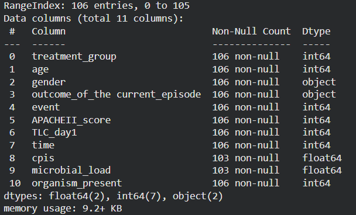
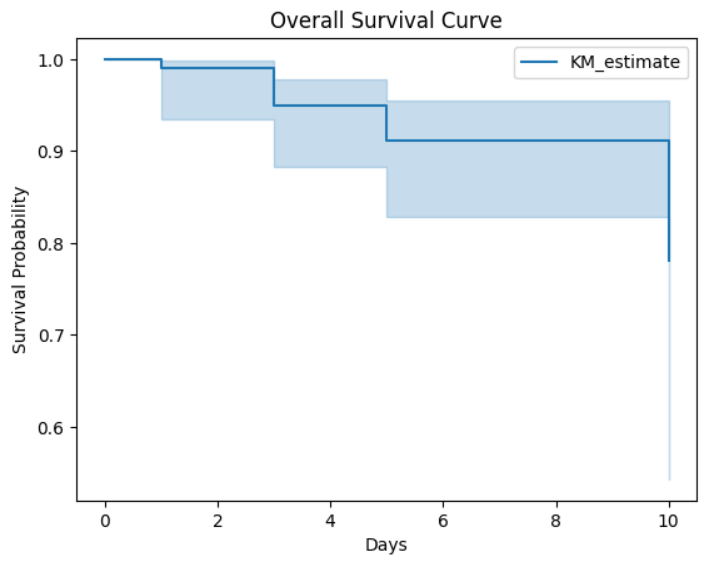
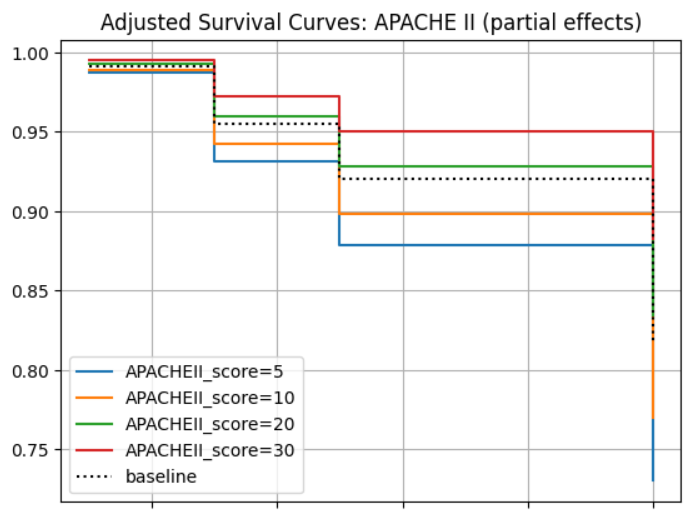
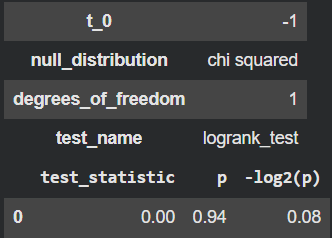
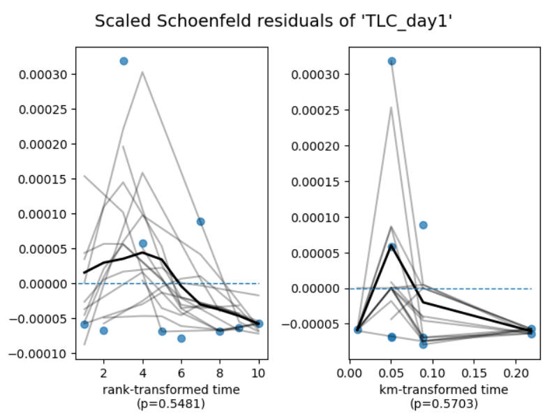
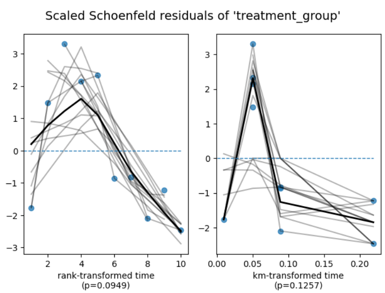

🎯 Survival Analysis of Chlorhexidine Trial Outcomes Using Python

👩‍⚕️ Author: Dr Vaishnavi K R
📘 Colab Notebook:
https://colab.research.google.com/drive/1b5pE58pYSHCVcbzj_wTYR3OQu6fqv9Ew?authuser=0

📌 Project Overview

This project performs a complete Survival Analysis on a Chlorhexidine clinical trial dataset.
It focuses on evaluating time-to-mortality and understanding the effect of treatment and key predictors.

You will find:
✔ Kaplan–Meier curves
✔ Cox Proportional Hazards modeling
✔ Log-Rank test
✔ PH assumption checks
✔ Clinical interpretation & hazard ratios

All steps follow a clean, reproducible Python workflow using pandas, lifelines, matplotlib, and seaborn.

📂 Dataset Description

Files:

Raw data → data/raw/

Cleaned data → data/cleaned/

Results/figures → results/

Documentation → document/

Important Variables:

time_to_event → Follow-up duration

event → 1 = death, 0 = censored

treatment_group → Chlorhexidine / Control

age, gender

APACHEII, TLC_D1

🎯 Problem Statements

Does Chlorhexidine reduce the hazard of death?

Do survival probabilities differ between treatment groups?

Which baseline variables significantly affect hazard?

Is age or APACHEII score predictive of survival?

🎓 Objectives

Perform EDA on survival data

Estimate survival curves (KM)

Conduct Log-Rank tests

Fit Cox PH models

Assess PH assumptions

Provide clinical interpretation

🧪 Methodology
1. Data Preparation

Handling missing values

Encoding categorical variables

Creating duration & event objects

2. EDA

Basic cohort description

Event vs. censored proportions

Distribution plots

3. Survival Modeling

Kaplan–Meier survival estimation

Log-Rank group comparison

Cox Proportional Hazards

Schoenfeld residual diagnostics

4. Interpretation

Hazard ratios

Clinical significance

Adjustment for confounders

📈 Key Visualizations
1️⃣ Basic Structure of Data

2️⃣ Kaplan–Meier Model

3️⃣ Survival Curves by Treatment Group

4️⃣ Adjusted Survival Curves — APACHE II

.png)

5️⃣ Adjusted Survival Curves — Treatment

6️⃣ Cox Model — Hazard Ratios

.png)

7️⃣ Log-Rank Test

8️⃣ Proportional Hazards Checks

📊 Results & Interpretation (Template)

Chlorhexidine shows a lower hazard of mortality (HR < 1).

Age and APACHEII appear to be strong predictors, with higher values increasing hazard.

Survival curves suggest better survival probability in treatment group.

Log-Rank test confirms statistical difference between groups.

(Replace with your actual numerical results.)

🩺 Discussion

Treatment appears effective in reducing mortality hazard.

Predictors behave consistently with clinical expectations.

PH assumptions hold for most covariates.

Dataset limitations include censoring bias & sample size.

🏁 Conclusion

Chlorhexidine intervention demonstrates promising improvements in survival outcomes.
Key predictors such as APACHEII and age significantly affect mortality hazard—supporting the use of Cox PH modeling in clinical decision-making.

🚀 Future Work

Time-varying Cox models

Parametric survival models

Machine learning survival models

External dataset validation
