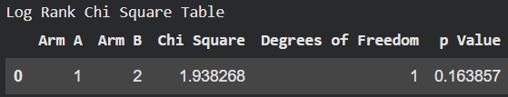
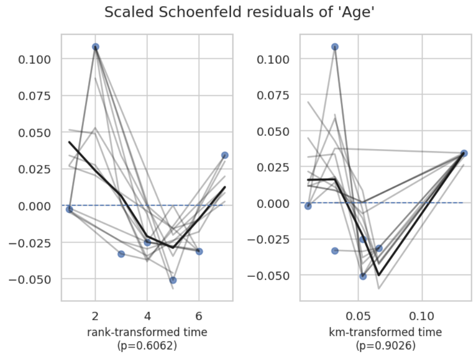
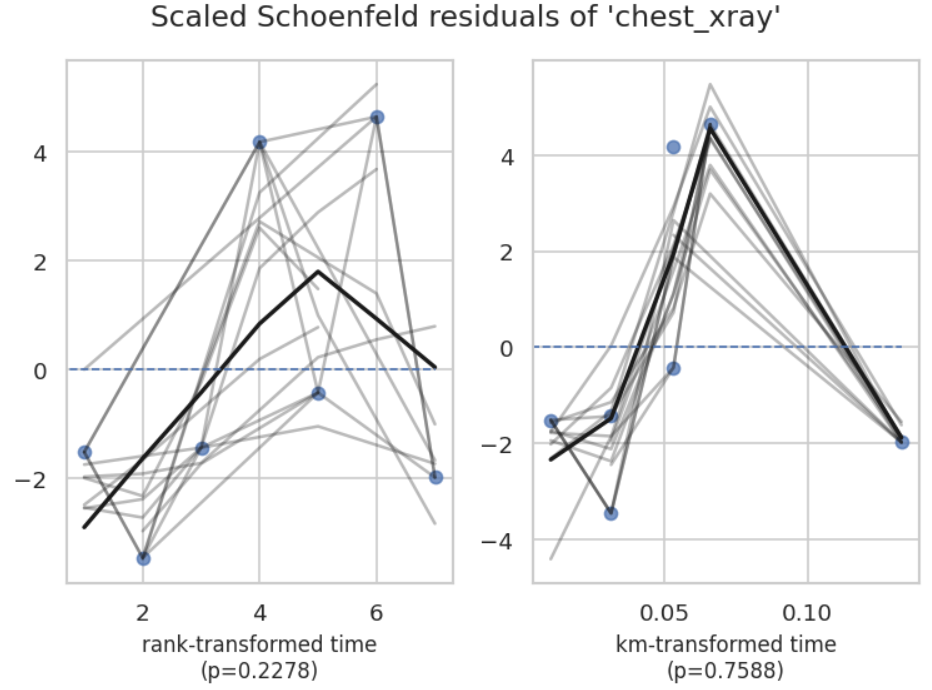
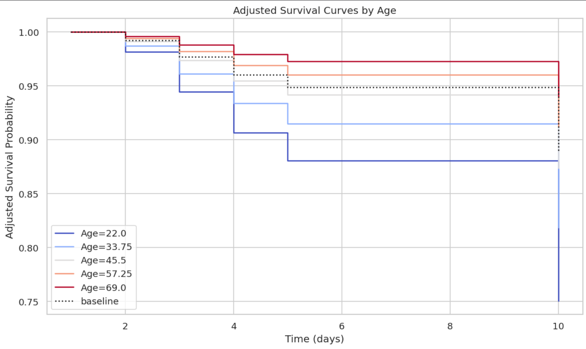
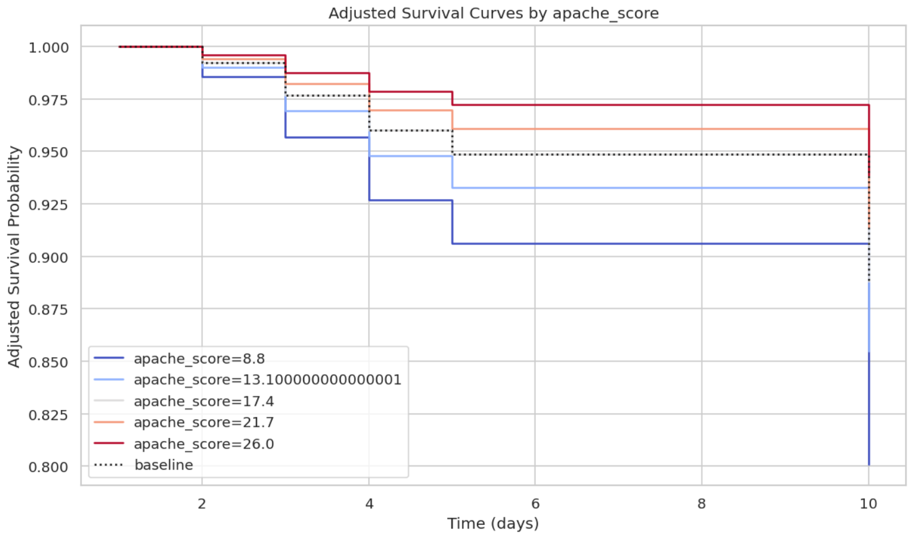

# 🧪 Survival Analysis of Chlorhexidine Trial Outcomes  
**Kaplan–Meier • Log-Rank • Cox PH • Schoenfeld Diagnostics**  


The complete article is included in the repository at:  
📄 **[/document/Publication.pdf](document/Publication.pdf)**

This repository reproduces and interprets **time-to-VAP (Ventilator-Associated Pneumonia)** outcomes from a randomized clinical trial comparing **0.12% vs 0.20% chlorhexidine** mouthwash in ICU patients.

All results, tables, and plots are generated using the Python scripts in this repository.

---

# 2️⃣ Project Summary
This project analyzes patient-level data from a randomized controlled trial comparing **0.12% vs 0.20% chlorhexidine** for preventing VAP in mechanically ventilated ICU patients.

### **Outcome**
- **time** → number of days until VAP  
- **event** → 1 = VAP occurred, 0 = censored (discharged, death, LAMA)

### **Why Survival Analysis?**
Patients had **different follow-up durations**, and many were **censored**, making classical statistics invalid.  
Thus, survival methods such as **Kaplan–Meier**, **Log-Rank test**, **Cox model**, and **Schoenfeld checks** were used.

---

# 3️⃣ Dataset Description  

### 📚 Data Files
- `data/Chlorhexidine Trials.xlsx`  
- `data/Data form Chlorhexidine Trial (Raw).xlsx`

### 📘 Core Variables

| Column        | Description                    | Type |
|---------------|--------------------------------|------|
| Age           | Age in years                   | Continuous |
| Gender        | Male / Female                  | Categorical |
| treatment_arm | 1 = 0.12%, 2 = 0.20%           | Categorical |
| apache_score  | APACHE II severity score       | Continuous |
| tlc_score     | Total leukocyte count          | Continuous |
| microbial_load| Microbial load (Day 1)         | Continuous |
| time          | Time to VAP / censoring        | Continuous |
| event         | 1 = VAP, 0 = No VAP            | Binary |

---

# 4️⃣ Problem Statement  

This project answers key clinical questions:

- Does **chlorhexidine 0.20%** reduce the hazard of VAP compared to 0.12%?
- Is VAP-free survival different between the two treatment groups?
- Do baseline predictors (Age, APACHE II, TLC, Microbial load, Gender) affect time-to-VAP?
- Do survival curves differ significantly (Log-Rank test)?
- What do hazard ratios from the Cox model imply clinically?

---

# 5️⃣ Objectives  

- Clean and preprocess the clinical dataset  
- Perform exploratory data analysis (EDA)  
- Estimate survival curves (overall + by treatment arm)  
- Compare groups using Log-Rank test  
- Fit Cox Proportional Hazards model  
- Check PH assumption using Schoenfeld residuals  
- Generate adjusted survival curves  
- Interpret survival estimates and hazard ratios clinically  

---

# 6️⃣ Methodology  

### **6.1 Data Preparation**
- Import dataset  
- Handle missing values  
- Encode categorical variables  
- Rename variables where needed  
- Create survival objects: `duration = time`, `event = event`  

### **6.2 Exploratory Data Analysis**
- Distribution of events vs censored  
- Summary statistics  
- Histograms, boxplots  
- Correlation heatmap  
- Initial KM survival curves  

### **6.3 Survival Modelling**
⭐ Kaplan–Meier Estimator  
⭐ Life Tables  
⭐ Log-Rank Test  
⭐ Cox Proportional Hazards Model  
⭐ Checking PH assumptions (Schoenfeld residuals)  

### **6.4 Model Evaluation & Interpretation**
- Hazard ratios  
- P-values  
- 95% Confidence Intervals  
- Clinical significance interpretation  

---

# 7️⃣ Python Implementation Structure  

```
├── data/
│ ├── Chlorhexidine Trials.xlsx
│ └── Data form Chlorhexidine Trial (Raw).xlsx
│
├── document/
│ ├── Publication.pdf
│ └── interpretation_of_survival_analysis.docx
│
├── results/
│ ├── adj_sc_micload.png
│ ├── adj_sc_age.png
│ ├── adj_sc_apachiscr.png
│ ├── adj_sc_chestxray.png
│ ├── adj_sc_culture.png
│ ├── adj_sc_tlc_scr.png
│ ├── correl_heatmap.png
│ ├── cox_fit_ppl_hz.png
│ ├── cox_forest_hr.png
│ ├── cox_hr_table_final.csv
│ ├── event_distribn.png
│ ├── hazard_ratio_tbl.png
│ ├── km_overall.png
│ ├── km_trail_arm.png
│ ├── logrank_two_arm_table.csv
│ ├── lr_chi_table.png
│ ├── nelson_aalen.png
│ ├── ss_r_age.png
│ ├── ss_r_apachscr.png
│ ├── ss_r_chestxray.png
│ ├── ss_r_culture.png
│ ├── ss_r_mcr_load.png
│ └── ss_r_tlc_scr.png
│
├── Chlorhexidine_Survival_Analysis.ipynb
├── LICENSE
├── README.md
└── requirements.txt
```

---

# 8️⃣ Key Results & Visualizations  

### **📌 1. Kaplan–Meier (Overall Survival)**


### **📌 2. KM by Treatment Arm**


### **📌 3. Log-Rank Test**


### **📌 4. Cox Model – Forest Plot**


### **📌 5. Schoenfeld Residual Diagnostics**
Examples:




### **📌 6. Adjusted Survival Curves**




---

# 🔟 Discussion  

- Both chlorhexidine concentrations show **high VAP-free survival**.  
- Visual trend suggests 0.20% may perform slightly better, but **not statistically significant**.  
- Cox model results show **no strong predictors** due to small number of events.  
- PH assumption was **not violated** → model is valid.  

---

# 1️⃣1️⃣ Conclusion  

- No significant difference between 0.12% and 0.20% chlorhexidine.  
- Cox model shows **no major hazard predictors** in this dataset.  
- Low event count limits statistical power.  
- Both concentrations are clinically comparable for VAP prevention.  

---

# 1️⃣2️⃣ Future Work  

- Larger sample size with more VAP events  
- Time-varying Cox models  
- Parametric survival models (Weibull, Exponential)  
- Machine learning survival techniques (RSF, DeepSurv)  
- Competing risks analysis (VAP vs mortality)  

---

# 📄 License  
This project is licensed under the **MIT License**.

---

<p align="center">
  
</p>
