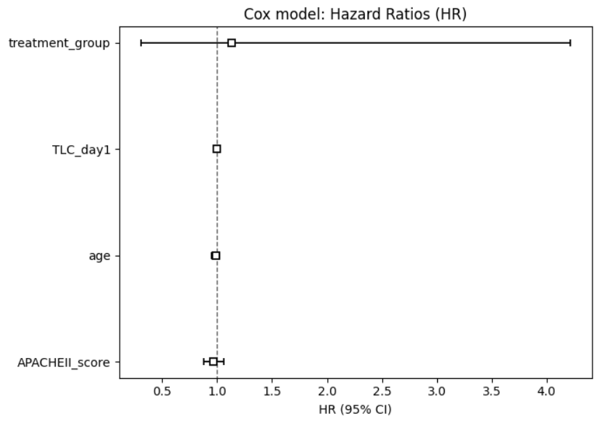
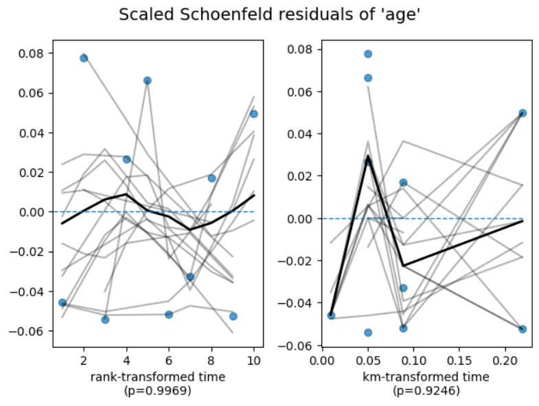

# 🧪📈 Survival Analysis of Chlorhexidine Trial Outcomes Using Python  

This repository reproduces survival outcomes from the clinical study:  
**“Effectiveness of Oral Hygiene with Chlorhexidine Mouthwash with 0.12 percent and 0.2 percent Concentration on Incidence of VAP”**  
Published in *Annals of International Medical and Dental Research* (2021).

📄 The complete paper is included under:  
`/document/Publication.pdf`

All results, tables, and plots were generated using the notebook:  
`Survival_Analysis_of_Chlorhexidine_Trial_Patients_.ipynb`

---

# 1️⃣ Project Title  
## **Survival Analysis of Chlorhexidine Trial Outcomes Using Python**

---

# 2️⃣ Project Summary ✍️  
This project analyses patient-level survival behaviour in an ICU-based randomized trial comparing **0.12% vs 0.20% chlorhexidine** for the prevention of **Ventilator-Associated Pneumonia (VAP)**.

### Outcome  
- **time** = days until VAP (event = 1)  
- **censoring** for discharge/death/LAMA (event = 0)

### Why Survival Analysis  
Survival methods correctly handle unequal follow-up times and heavy censoring.

### What This Project Teaches  
- Kaplan–Meier estimation  
- Log-Rank hypothesis testing  
- Cox Proportional Hazards modelling  
- Schoenfeld residual tests  
- Clinical interpretation of hazard ratios  

---

# 3️⃣ Dataset Description 📚  

Study datasets located in `/data/`:

| File | Description |
|------|-------------|
| **Chlorhexidine Trials Data Cleaned.xlsx** | Final cleaned dataset used for modelling |
| **Data form Chlorhexidine Trial (Raw).xlsx** | Original collected case-record data |
| **cox_model_variables.xlsx** | Variables prepared for Cox modelling |

### Core Variables

| Column | Description | Type |
|--------|-------------|------|
| Age | Age in years | Continuous |
| Gender | Male / Female | Categorical |
| TrialArm_num | 1 = 0.12%, 2 = 0.20% | Categorical |
| APACHEII | Severity score | Continuous |
| TLC_D1 | Leukocyte count (Day 1) | Continuous |
| time | Days to VAP or censoring | Continuous |
| event | 1 = VAP, 0 = No VAP | Binary |

---

# 4️⃣ Problem Statement ❓  
This project answers:

- Does **0.20% chlorhexidine** reduce hazard of VAP compared to **0.12%**?
- Are survival curves different between treatment arms?
- Do factors like **Age, APACHE II, TLC D1, Gender** predict VAP risk?
- Does the Log-Rank test show group differences?
- What is the clinical meaning of Cox model hazard ratios?

---

# 5️⃣ Objectives 🎯  
- Data cleaning and preprocessing  
- Baseline summary statistics & EDA  
- Kaplan–Meier survival estimation  
- Log-Rank comparison between arms  
- Cox Proportional Hazards modelling  
- PH assumption checks (Schoenfeld tests)  
- Generate interpretable survival visualizations  

---

# 6️⃣ Methodology 🛠️  

## 6.1 Data Preparation  
- Cleaned naming conventions (`APACHEII`, `TLC_D1`, etc.)  
- Encoded categorical variables (`TrialArm_num`, gender binaries)  
- Ensured numeric survival columns: `time`, `event`  
- Model variables included:  
  `time, event, Age, APACHEII, TLC_D1, TrialArm_num, Gender_binary`

**Missing Data Handling:**  
- Median imputation for APACHEII & TLC_D1 (robust to skewness)

---

## 6.2 Exploratory Data Analysis (EDA) 🔍  

### Baseline Structure  
- Total N = 106  
- Events (VAP) = 10  
- Mean Age ≈ 47.6  
- APACHE II ≈ 16.9  
- TLC Day 1 ≈ 15,200  
- Arm1 n = 61, Arm2 n = 45  
- Male = 93, Female = 13  
- Mean follow-up ≈ 5.7 days  

### Visual Exploration  
- Age histogram  
- APACHE II histogram  
- TLC boxplot  
- Life-tables (overall & per-arm)  
- KM curves with confidence intervals  

---

# 6.3 Survival Modelling  
Applied models:

- Overall Kaplan–Meier survival  
- Arm-stratified KM curves  
- Log-Rank test (Arm 1 vs Arm 2)  
- Cox Proportional Hazards model  
- Schoenfeld residual tests for PH assumption  

---

# 7️⃣ Repository Structure 💻

```
.
├── data/
│   ├── Chlorhexidine Trials Data Cleaned.xlsx
│   ├── Data form Chlorhexidine Trial (Raw).xlsx
│   └── cox_model_variables.xlsx
│
├── document/
│   └── Publication.pdf
│
├── results/
│   ├── Basic_structure_of_Data.png
│   ├── Cox_model_Hazard_Ratios.png
│   ├── KM_model.png
│   ├── Log_Rank_Test.png
│   ├── Survival_Curves_APACHE_II.png
│   ├── Survival_Curves_Treatment_Group.png
│   ├── ph_check_APACHEII.png
│   ├── ph_check_tcl_1.png
│   ├── ph_chk_tr_gp1.png
│   ├── proportional_hazards_check_age.png
│   └── sc_trgp.png
│
├── Projectbanner/
├── Survival_Analysis_of_Chlorhexidine_Trial_Patients_.ipynb
├── requirements.txt
└── README.md
```

---

# 8️⃣ Key Visualizations 📊  

<div align="center">
  
</div>

<div align="center">
  
</div>

<div align="center">
  
</div>

<div align="center">
  
</div>

<div align="center">
  
</div>

---

# 9️⃣ Results & Interpretation 🧾  

### 1. Overall KM Survival  
- VAP-free survival >90% across first 10 days  
- Very low event count → high censoring  

### 2. KM by Treatment Arm  
- **Arm 1 (0.12%)**: more curve drops (7 VAP events)  
- **Arm 2 (0.20%)**: flatter survival curve (2 VAP events)  
- Visual trend favours 0.20%, but not significant  

### 3. Log-Rank Test  
- **p = 0.94** → no statistical difference  

### 4. Cox PH Model  
- TrialArm HR ≈ **0.97 (p ≈ 0.97)** → no detectable hazard difference  
- All predictors HR ≈ 1  
- Concordance = 0.59  

### 5. Proportional Hazards  
- All PH tests p > 0.05 → PH assumption satisfied  

💡 *Cox Summary tells what the model found; the PH Test confirms whether the model is valid.*

---

# 🔟 Discussion 💬  
- Both chlorhexidine concentrations show excellent short-term VAP prevention.  
- Although 0.20% had fewer events, survival patterns were statistically similar.  
- Age, APACHE II, TLC D1, gender, and treatment arm did **not** considerably impact hazard of VAP.  
- High censoring and short follow-up likely dilute detectable differences.  

---

# 1️⃣1️⃣ Conclusion ✅  
- Both strengths support high VAP-free survival.  
- 0.20% slightly better numerically, but statistically similar.  
- No baseline predictors significantly influenced hazard.  
- Survival analysis provided structured and clinically relevant insights.  

---

# 1️⃣2️⃣ Future Work 🔭  
- Time-varying covariates  
- Parametric survival models (Weibull, Exponential)  
- Machine-learning survival models (RSF, DeepSurv)  
- External validation with ICU datasets (e.g., MIMIC)  
- Competing risks (VAP vs. death)

---

# 📞 Contact / Citation  
Original clinical trial authors:  
*Nagesh Vyas, Priya Mathur, Shailesh Jhawar, Akash Prabhune, Pradeep Vimal (2021)*

Notebook: `Survival_Analysis_of_Chlorhexidine_Trial_Patients_.ipynb`  
Study publication: `/document/Publication.pdf`

---

