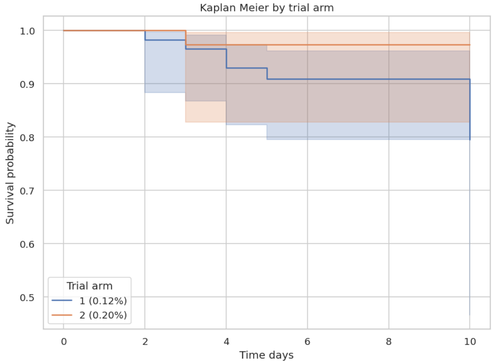

# 🧪 Survival Analysis of Chlorhexidine Trial (0.12% vs 0.20%)

This repository reproduces survival outcomes from a randomized clinical trial evaluating **0.12% vs 0.20% chlorhexidine mouthwash** for preventing Ventilator-Associated Pneumonia (VAP) in ICU patients.

📄 [Article (PDF)](document/Publication.pdf)
 
📘 [Interpretation Document](document/interpretation_of_survival_analysis.docx)

---

## 🚀 Project Summary
A survival analysis was performed using:
- Kaplan–Meier curves (overall + by treatment arm)  
- Log-Rank test  
- Cox Proportional Hazards Model  
- Schoenfeld PH assumption checks  
- Adjusted survival curves & forest plots  

**Outcome:** Time (days) to VAP (event=1) or censoring (event=0).  
**Finding:** Both concentrations showed **similar VAP-free survival**.  
Log-Rank p = **0.16** → *no significant difference*.

---

## 📚 Dataset Description

| Variable | Description | Type |
|---------|-------------|------|
| time | Days until VAP or censoring | Numeric |
| event | 1 = VAP, 0 = censored | Binary |
| Age | Age in years | Numeric |
| Gender | Male/Female | Categorical |
| treatment_arm | 1 = 0.12%, 2 = 0.20% | Categorical |
| apache_score | APACHE II score | Numeric |
| tlc_score | Total leukocyte count | Numeric |
| microbial_load | Microbial load | Numeric |
| chest_xray, culture, ulcer | Clinical indicators | Binary |

Data files stored in: `data/`

---

## 🎯 Objectives
- Compare VAP-free survival between treatment arms  
- Identify predictors influencing VAP risk  
- Evaluate hazard ratios using Cox PH  
- Validate PH assumption visually & statistically  

---

## 🛠️ Methodology (Compact)

### **1. Data Preparation**
- Import datasets  
- Clean variable names  
- Encode categorical features  
- Create survival objects: `duration = time`, `event = event`

### **2. Exploratory Analysis**
- Summary statistics  
- Event vs censored distribution  
- Correlation heatmap  

### **3. Survival Modelling**
- Kaplan–Meier overall & by group  
- Log-Rank significance test  
- Cox Proportional Hazards  
- Schoenfeld residuals (PH check)  

### **4. Model Evaluation**
- Hazard ratios (HR + 95% CI)  
- p-values  
- Adjusted survival curves  
- Forest plots for predictors  

---

## 📂 Repository Structure

```
.
├── data/
│ ├── Chlorhexidine Trials.xlsx
│ └── Data form Chlorhexidine Trial (Raw).xlsx
│
├── document/
│ ├── Publication.pdf
│ └── interpretation_of_survival_analysis.docx
│
├── results/
│ ├── adj_sc_micload.png
│ ├── adj_sc_age.png
│ ├── adj_sc_apachiscr.png
│ ├── adj_sc_chestxray.png
│ ├── adj_sc_culture.png
│ ├── adj_sc_tlc_scr.png
│ ├── correl_heatmap.png
│ ├── cox_fit_ppl_hz.png
│ ├── cox_forest_hr.png
│ ├── cox_hr_table_final.csv
│ ├── event_distribn.png
│ ├── hazard_ratio_tbl.png
│ ├── km_overall.png
│ ├── km_trail_arm.png
│ ├── logrank_two_arm_table.csv
│ ├── lr_chi_table.png
│ ├── nelson_aalen.png
│ ├── ss_r_age.png
│ ├── ss_r_apachscr.png
│ ├── ss_r_chestxray.png
│ ├── ss_r_culture.png
│ ├── ss_r_mcr_load.png
│ └── ss_r_tlc_scr.png
│
├── Chlorhexidine_Survival_Analysis.ipynb
├── LICENSE
├── README.md
└── requirements.txt
```

---

## 📊 Key Results

### **Kaplan–Meier Overall**


### **KM by Treatment Arm**


### **Cox HR Forest Plot**


---

## 💬 Discussion
- Survival remained **high overall**, with very few VAP events.  
- 0.20% chlorhexidine showed a **non-significant** trend toward lower hazard.  
- Cox model: No strong predictors; all variables had wide CI due to **low event numbers**.  
- PH assumptions **not violated** → Cox model valid.  

---

## ✅ Conclusion
- **No statistically significant difference** between 0.12% and 0.20% concentrations.  
- Both concentrations performed **clinically similarly** in preventing VAP.  
- Study limited by **small number of VAP events**.

---

## 🔭 Future Work
- Larger sample size to increase event count  
- Time-varying Cox models  
- Parametric survival modelling (Weibull, exponential)  
- ML-based survival analysis (RSF, DeepSurv)  

---


## 📄 License
This project is licensed under the **MIT License**.

---

<p align="center">
  
</p>
---
**End of README**  
---
